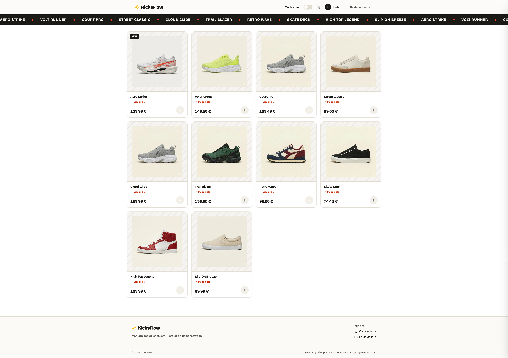
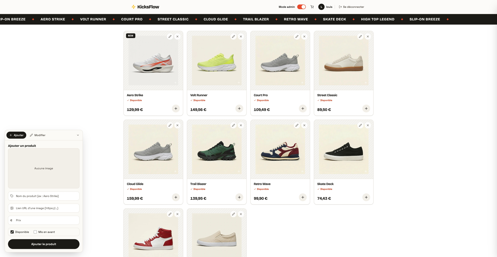

# ⚡ KicksFlow — Premium Sneaker Marketplace & Admin Dashboard

**[→ Live demo](https://YOUR-DEPLOY-URL)** · just enter any first name to explore — no account, no password.

KicksFlow is a premium sneaker **marketplace SPA** with a customer storefront and an **admin dashboard** (full CRUD + shopping cart), backed by Firebase. A personal project built to showcase a modern front-end stack, global state management with React Context, and integration with a NoSQL database.



> _Customer storefront — catalog & shopping cart. Product images are AI-generated (demonstration project)._

## 🚀 Key Features

- **Per-user storefronts** — each username gets its own catalog, loaded from Firestore (created on the fly for new visitors).
- **Shopping cart** — add items, update quantities, remove, with a live total computed from state; persisted to `localStorage`.
- **Admin dashboard** — toggle admin mode for a full CRUD workflow: add, inline-edit and delete products, with changes reflected instantly in the catalog.
- **Persistence, split by concern** — the menu is saved per user to **Firestore**, the cart to **localStorage** — each where it belongs.
- **Polished edge cases** — loading skeletons, an on-brand 404 page, and a dedicated "user not found" state.



> _Admin mode — add, edit and delete products in place, synced to Firestore._

## 🛠️ Tech Stack

- **Framework:** React 19 (Vite)
- **Language:** TypeScript (strict)
- **Design system:** Tailwind CSS v4 (custom theme, editorial aesthetic)
- **Routing:** React Router v7
- **Database:** Firebase Firestore (cloud persistence)

## 📦 Local Setup

1. **Clone the repository**

```bash
git clone https://github.com/louiscollard/KicksFlow.git
cd KicksFlow
```

2. **Install dependencies**

```bash
npm install
```

3. **Configure environment variables** — create a `.env.local` file at the project root with your Firebase credentials:

```
VITE_FIREBASE_API_KEY=your_api_key
VITE_FIREBASE_AUTH_DOMAIN=your_auth_domain
VITE_FIREBASE_PROJECT_ID=your_project_id
VITE_FIREBASE_STORAGE_BUCKET=your_storage_bucket
VITE_FIREBASE_MESSAGING_SENDER_ID=your_messaging_sender_id
VITE_FIREBASE_APP_ID=your_app_id
```

4. **Start the dev server**

```bash
npm run dev
```