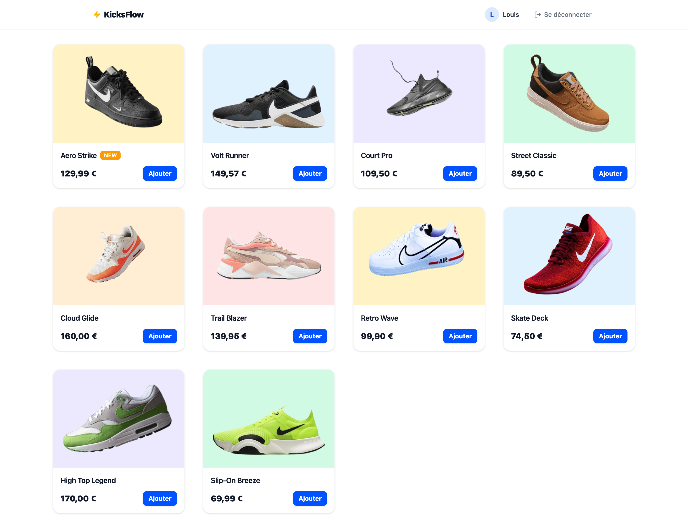

# ⚡ KicksFlow — Premium Sneaker Marketplace & Dashboard

**KicksFlow** is an inventory management SaaS and premium sneakers marketplace featuring a minimalist, modern design. This project showcases proficiency in a modern Front-End stack, complex global state management, and real-time integration with a NoSQL database.

---



---

## 🚀 Key Features

- **Customer E-Space:** Seamless sneaker catalog and advanced shopping cart (live total calculations and quantity updates).
- **Admin Dashboard:** Full CRUD system featuring a "Live" editing form (changes instantly reflect across the product catalog).
- **Persistence:** Immediate synchronization of products and carts via a real-time database.

---

## 🛠️ Tech Stack

- **Framework:** React 19 (Vite)
- **Language:** TypeScript (Strict typing for data streams)
- **Design System:** Tailwind CSS (Custom integration, clean & modern aesthetic)
- **Routing:** React Router v7
- **Database:** Firebase Firestore (Real-time tracking)

---

## 💻 Local Setup

Follow these steps to run the project locally on your machine:

1. Clone the repository
   
```bash
   git clone [https://github.com/YOUR_USERNAME/kicksflow.git](https://github.com/YOUR_USERNAME/kicksflow.git)
   cd kicksflow
   ```
   
2. Install dependencies

```bash
   npm install
   ```
   
3. Configure the environment variables
   Create a .env.local file at the root of the project and add your Firebase credentials:

```env
   VITE_FIREBASE_API_KEY=your_api_key
   VITE_FIREBASE_AUTH_DOMAIN=your_auth_domain
   VITE_FIREBASE_PROJECT_ID=your_project_id
   VITE_FIREBASE_STORAGE_BUCKET=your_storage_bucket
   VITE_FIREBASE_MESSAGING_SENDER_ID=your_messaging_sender_id
   VITE_FIREBASE_APP_ID=your_app_id
  ```
  
4. Start the development server

```bash
   npm run dev
   ```
